  

  

  
  
  

---

### 🚀 About Me

Full-Stack Web Developer specializing in **ASP.NET MVC**, **SQL Server**, and **Python-based automation**. I independently built my Final Year Project — a digitized, interactive Quran-learning platform based on a curriculum used in 300+ Pakistani universities — and freelance internationally with a **4.8/5.0 rating** across 10+ delivered projects.

- 🎓 BS Computer Science (Web Engineering) @ BIIT, PMAS Arid University — *Expected Dec 2026*
- 🕌 FYP: **Mualim-UL-Quran**, an interactive Quran learning platform — approved by university committee
- 💼 Freelance Web Developer & Automation Specialist since 2024 — Freelancer.com, 4.8/5.0 ⭐
- 🏢 Founder of **WebLyteX** — an ASP.NET MVC development & QA/testing agency (in development)
- 📫 Reach me at **samraanarshad3@gmail.com**

---

### 🛠️ Tech Stack

**Backend**

  
  
  
  
  

**Frontend**

  
  
  
  
  
  

**Database**

  

**Automation & Scripting**

  
  
  
  
  

**Tools**

  
  
  
  
  
  

**Other**

  
  

---

### 📌 Featured Project — Final Year Project

> **Mualim-UL-Quran — Digital Quran Learning Workbook**
> A group FYP that digitized a physical Quran-learning workbook (based on Dr. Obaid Ur Rehman Bashir's curriculum, used across 300+ Pakistani universities) into a fully interactive web platform. Approved by the university committee and demoed live to the Director.

`ASP.NET MVC` `SQL Server` `jQuery AJAX` `Bootstrap 5` `C#` `ADO.NET`

- Architected a **4-tier learning flow** (Unit → Lesson → Activity → Exercise) to structure and track student progression end to end
- Built **SmartResume** logic that auto-resumes a student from their exact last attempted word
- Delivered a **Teacher Dashboard** with per-student KPIs — accuracy badges and correct/wrong answer counts — for real-time visibility without manual grading
- Implemented **AJAX-based answer submission** with instant right/wrong feedback, no full-page reloads
- Added a **Review Wrong Answers** module for targeted re-attempts
- Enforced **role-based authentication** across student/teacher portals with session-based redirection
- Built entirely on **raw ADO.NET** (SqlCommand, SqlDataReader, SqlDataAdapter) — no Entity Framework — for full control over query performance

🔗 [View Repository](https://github.com/samCoder-dot/Digital-Mualim-Ul-Quran)

---

### 💼 Experience

**Freelance Web Developer & Automation Specialist** — Freelancer.com | 2024 – Present | 4.8/5.0 ⭐
- Delivered 10+ projects across web development, data scraping, and automation for international clients with a 100% successful delivery rate
- Built a **Python + Selenium** data-extraction pipeline for a Greek client that scraped 20+ paginated pages and auto-converted results into structured Excel — cutting manual processing time by ~90%
- Shipped 6 contest-winning HTML/CSS entries across OTA booking, charity, real estate, café rebranding, dental clinic, and sci-fi landing page niches

**Web Development Intern** — MSN Academy (Remote) | July 2025 – Sept 2025
- Contributed to live client projects alongside a professional development team
- Completed the program in full with an official completion certificate

---

### 📂 Other Projects

| Project | Description | Stack |
|---|---|---|
| [WebLyteX](https://github.com/samCoder-dot) | Founded agency offering ASP.NET MVC dev, scraping & QA services — includes a responsive marketing site | ASP.NET MVC, Bootstrap 5, jQuery, Azure |
| [Scalable Polling System](https://github.com/samCoder-dot/scalable-polling-system) | Multi-poll platform with role-based access; admins manage polls, users vote with live real-time results | ASP.NET MVC, SQL Server, C# |
| [Naat Khawan Album Management System](https://github.com/samCoder-dot) | Registration & album-management system with SQL-injection prevention and secure image uploads | ASP.NET MVC, SQL Server, C# |
| [DentalClinicWebsite](https://github.com/samCoder-dot/DentalClinicWebsite) | Freelance contest-winning dental clinic site (Poland) | HTML, CSS |
| [MSN-ACADEMY-PROJECT](https://github.com/samCoder-dot/MSN-ACADEMY-PROJECT) | Work from MSN Academy remote internship | JavaScript |
| [Sci-Fi-Landing-Page](https://github.com/samCoder-dot/Sci-Fi-Landing-Page) | Freelance contest-winning sci-fi themed landing page | HTML, CSS |

*(Replace WebLyteX / Naat Khawan links with their actual repo URLs once pushed to GitHub.)*

---

### 📊 GitHub Stats

  
  

  

---

<i>Thanks for stopping by — feel free to explore my repositories and connect!</i>

